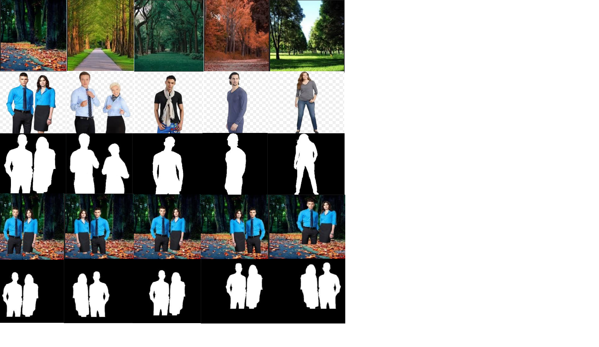

# EVA4_S14
Custom dataset preparation for the final depth estimation project

Drive link to dataset : https://drive.google.com/open?id=1Hr1OuftLZ0reDac1yJ2wAspwE9gnUQEi
1) bg :
      Forest, park, seashore and road. Total images = 100; Channels = RGB; Size = 905KB; Resolution = 224X224
2) fg :
      Men, Women, Children and combination of men-women, women-children and men-children. Total images = 100; Channels = RGB; Size = 576KB; Resolution = 160X160.
Gimp is used to remove the background in foreground images(made transparent). Understood difference between white bg and transparent bg.
3) fg_bg :
      Randomly placed each fg 40 times(with flips) over each bg. Total images = [100X100X(20X2)] 400K. Channels = RGB; Size = 2.2GB; Resolution = 224X224
4) fg_bg_mask :
      fg is converted from RGB to black and overlaid on top of black background. This is done along with step 3 (in the same for loop).
Total images = 400K. Size = 1.6GB; Resolution = 224X224      
5) fg_bg_depth :
      Tweaks with respect to image input folder and save have been made from the shared Dense Depth code. Image loading is done on CPU while prediction is done on GPU. Need to load the data as well in GPU for fast processing. Total images completed = 40K and remaining work-in-progress. 2000 images takes 15 minutes hence working on optimizations. Could have done this in the same for loop along with steps 3 and 4.
      
Mean and std. dev : Work-in-progress

Also placed all the images directly in drive which consumes more space and more time to load. Will convert them to zip and store in drive for easy storage and retrieval.

